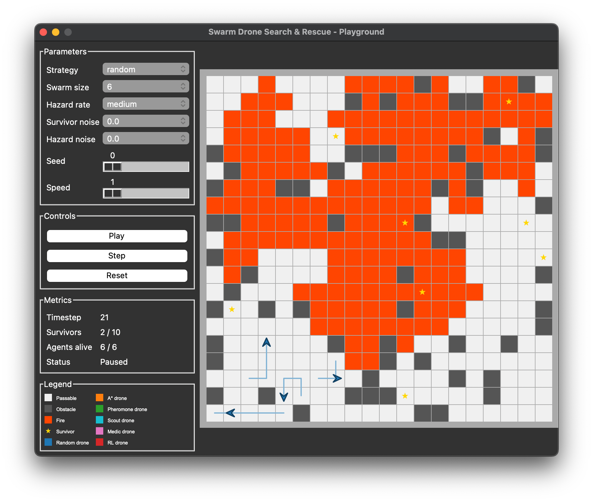
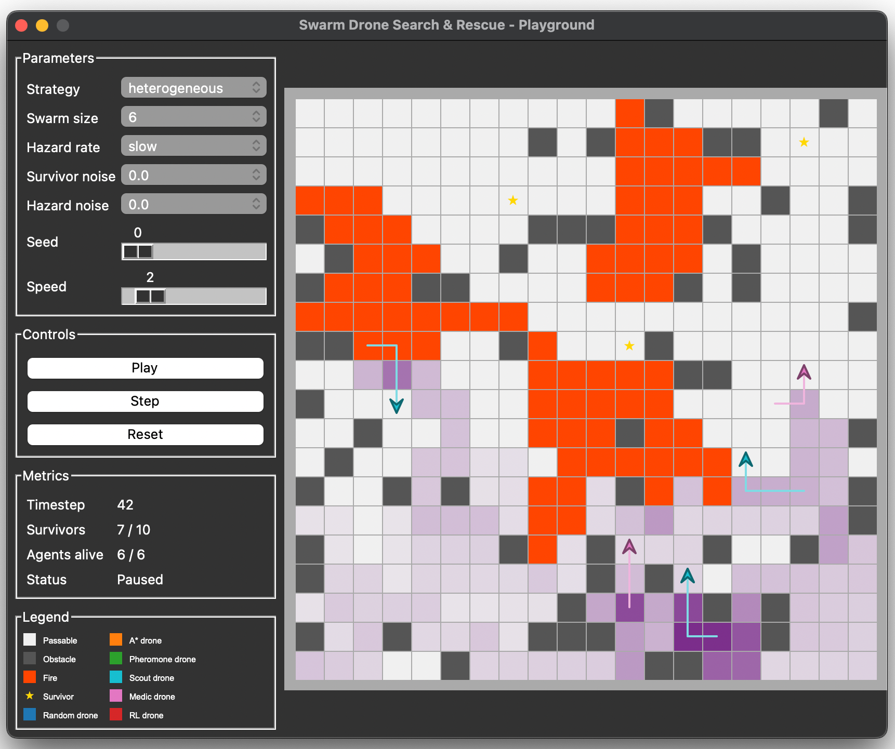

# Swarm Drone Search & Rescue

A swarm of autonomous drone agents explores a 20x20 grid-based disaster site to locate survivors.

The environment is dynamic: fire spreads probabilistically each timestep, agents have partial observability (a sensing radius of 2), and agents can be destroyed by fire. Three core coordination strategies are compared across 810 controlled simulation runs, with additional stretch experiments covering sensor noise, heterogeneous role specialisation, and a single-agent reinforcement learning (RL) baseline.

This project was developed as part of the COMP3004 Designing Intelligent Agents module at the University of Nottingham.


<p align="center"><em>Random strategy, swarm size 6, medium hazard, seed 0.</em></p>

## Strategies

**Core (swarm strategies):**
- **Random**: reactive random walk (baseline)
- **A\* Planned**: deliberative frontier-seeking with A* pathfinding
- **Pheromone**: Ant Colony Optimisation-inspired stigmergic coordination

**Stretch (additional experiments only):**
- **Heterogeneous**: mixed scout/medic roles -- scouts detect survivors (pheromone movement, radius 3), medics rescue them (A* navigation, radius 2)
- **RL**: single-agent PPO policy trained via Stable Baselines 3 (swarm_size=1 baseline only; not a swarm strategy)

## Installation

Clone the repository:

```bash
git clone https://github.com/rubenodamo/swarm-drone-search-rescue.git
cd swarm-drone-search-rescue

# Install dependencies
pip install -r requirements.txt
```

## Running Experiments

### Core experiment

Run all 810 simulations (3 strategies x 3 swarm sizes x 3 hazard rates x 30 seeds):

```bash
python experiments/run_experiments.py
```

Results are written to `results/raw/` as one CSV per run.

### Supplementary data

Run timeseries data collection (90 runs: swarm_size=6, hazard_rate=medium):

```bash
python experiments/run_timeseries.py
```

Run coverage heatmap data collection (same 90 runs):

```bash
python experiments/run_heatmaps.py
```

### Stretch experiments

Run sensor noise experiment (360 runs: 3 strategies x 4 noise levels x 30 seeds):

```bash
python experiments/run_noise_experiment.py
```

Run heterogeneous swarm experiment (60 runs: hetero vs pheromone, swarm_size=6, medium):

```bash
python experiments/run_hetero_experiment.py
```

Train the RL agent (saves policy to `results/rl_model/`):

```bash
python experiments/train_rl_agent.py
```

Run RL single-agent baseline (360 runs: 4 strategies including RL x 3 hazard rates x 30 seeds, swarm_size=1):

```bash
python experiments/run_rl_baseline.py
```

## Generating Figures and Statistics

```bash
python experiments/analyse_results.py
```

This reads from `results/raw/` and produces:
- `results/all_runs.csv`: flat table of all 810 runs
- `results/summary.csv`: mean and std per condition
- `results/significance_tests.txt`: Kruskal-Wallis and Mann-Whitney U pairwise tests
- `results/figures/`: all report figures (see below)

### Output figures

| Figure | Description |
|--------|-------------|
| `survivors_by_strategy.png` | Mean survivors found by strategy, grouped by hazard rate (swarm_size=6) |
| `survivors_scaling.png` | Survivors vs swarm size, faceted by hazard rate (all conditions) |
| `coverage_vs_hazard_rate.png` | Coverage % vs hazard rate per strategy (swarm_size=6) |
| `agent_losses_boxplot.png` | Agent losses boxplot by strategy and swarm size (all sizes) |
| `survivors_over_time.png` | Cumulative survivors found over time (swarm_size=6, medium) |
| `coverage_heatmap_*.png` | Spatial coverage heatmaps per strategy (swarm_size=6, medium, averaged over 30 seeds) |
| `survivors_vs_noise.png` | Survivor degradation under sensor noise (stretch) |
| `agents_lost_vs_noise.png` | Agent mortality under sensor noise (stretch) |
| `hetero_comparison.png` | Heterogeneous vs pheromone swarm comparison (stretch) |
| `rl_baseline_comparison.png` | RL vs engineered strategies at swarm_size=1 (stretch) |

## Live Visualisation

```bash
python visualisation/playground.py
```


<p align="center"><em>Heterogeneous strategy, swarm size 6, slow hazard, seed 0.</em></p>

- Opens an animated Tkinter window with a 20x20 grid
- Use the left panel to select strategy, swarm size, hazard rate, seed, and speed
- Press Play to start; supports pause, single-step, and reset
- Pheromone intensity is shown as a purple overlay when strategy is `pheromone` or `heterogeneous`
- Survivor and hazard detection noise can be set independently via the left panel
- When strategy is `rl`, the trained PPO policy is loaded automatically and swarm size is fixed at 1

## Running Tests

```bash
pytest -v
```

## Project Structure

```bash
├── src                                     # Simulation source modules
│   ├── environment/                        # Simulation environments
│   │   ├── grid.py                         # Grid, obstacles, survivors, fire logic
│   │   └── drone_search_env.py             # Gymnasium wrapper for RL training (stretch)
│   │
│   ├── agents/                             # Drone agent implementations
│   │   ├── base_drone.py                   # DroneAgent base class (perception, movement)
│   │   ├── random_drone.py                 # Random walk strategy
│   │   ├── astar_drone.py                  # A* frontier-seeking strategy
│   │   ├── pheromone_drone.py              # Stigmergic pheromone strategy
│   │   ├── scout_drone.py                  # Heterogeneous scout role (stretch)
│   │   ├── medic_drone.py                  # Heterogeneous medic role (stretch)
│   │   └── rl_drone.py                     # PPO policy agent (stretch)
│   │
│   ├── model/                              # DisasterModel and pheromone grid
│   │   └── disaster_model.py
│   │
│   ├── strategies/                         # Strategy algorithms, no Mesa dependency
│   │   └── astar.py
│   │
│   └── metrics/                            # MetricsCollector and CSV writer
│       └── collector.py
│
├── experiments                             # Experiment runners and analysis
│   ├── run_experiments.py
│   ├── run_timeseries.py
│   ├── run_heatmaps.py
│   ├── run_noise_experiment.py             
│   ├── run_hetero_experiment.py     
│   ├── train_rl_agent.py            
│   ├── run_rl_baseline.py                  
│   └── analyse_results.py                  
│
├── results                                 # Outputs (CSVs and figures)
│   ├── raw/
│   ├── raw/timeseries/
│   ├── all_runs.csv
│   ├── timeseries_all.csv 
│   ├── coverage_mean.csv
│   ├── noise_runs.csv
│   ├── hetero_runs.csv
│   ├── rl_baseline_runs.csv
│   └── figures/                          
│
├── tests                                   # Unit tests
│   ├── test_agents.py
│   ├── test_analyse_results.py
│   └── ...
│
└── visualisation                           # Tkinter animated playground
    └── playground.py                       
```

## Technologies

- Python 3.10+
- Mesa (agent-based simulation)
- NumPy
- pandas
- matplotlib / seaborn
- scipy (statistical tests)
- stable-baselines3 + gymnasium (RL training)
- pytest

## Code Quality & Tooling

| Tool   | Purpose       | Config           |
|--------|---------------|------------------|
| Black  | Formatter     | `pyproject.toml` |
| isort  | Import sorter | `pyproject.toml` |
| pylint | Linter        | `.pylintrc`      |

```bash
# Format
black src/ tests/
isort src/ tests/

# Lint
pylint src/
```

## Notes
- All random operations use `numpy.random.default_rng(seed)` for reproducibility.
- Raw CSVs in `results/raw/` are gitignored and must be regenerated by running the experiment scripts.
- The RL strategy is a single-agent exploratory baseline (swarm_size=1) and is not part of the main 810-run dataset.
